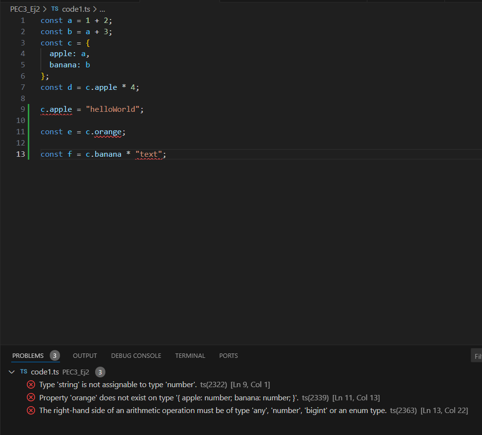

# PEC3 - Ejercicio 2: Primeros códigos en TypeScript

## Captura del TypeError en `code1.ts`
**Captura de pantalla:**

**Explicación del error:**
Se generó un error porque...

---

## Tipos inferidos en `code2.ts`
| Variable | Tipo Inferido       | Justificación                              |
|----------|---------------------|-------------------------------------------|
| a        | number              | Es un número explícito.                   |
| b        | ...                 | ...                                       |
| ...      | ...                 | ...                                       |

---

## Errores en `code3.ts`
1. **Error 1:**  
   - **Por qué se genera:**  
   - **Explicación:**

2. **Error 2:**  
   - ...

---

## Diferencia entre clase e interfaz
| Aspecto                  | Clase                              | Interfaz                        |
|--------------------------|-------------------------------------|---------------------------------|
| Uso principal            | Implementación de lógica.          | Definir contratos de objetos.  |
| Genera código en JS      | Sí.                                | No, se elimina en la transpilación. |
| Admite métodos estáticos | Sí.                                | No.                            |

**Conclusión:** Una clase implementa una interfaz y contiene métodos y propiedades concretas, mientras que la interfaz define la forma del objeto.